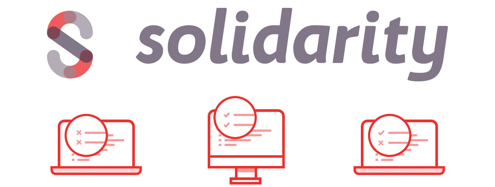

<p align="center">
  
  <h3 align="center">Solidarity is an environment checker for project dependencies across multiple machines.</h3>
  <hr/>
<a href='https://semaphoreci.com/ir/solidarity'> </a>
</p>

# :star: This project is in Github Alpha :star:
Not all npm packages mentioned are released or even ready.  Plugins are still being developed.

**WHY DOES SOLIDARITY EXIST?** Package management `.lock` files help zero-in on dependencies, but some stacks need more! For example, React Native needs specific Android SDK, Pods, Xcode, node, & even versions of NPM and Yarn.  Solidarity is the perfect tool for making sure your team is sharing the same complex environment without worrying about the environment complexity.

## Docs
* [Solidarity Rules Options](./options.md)
* [Write Solidarity Plugins](./plugins.md)
* [Available Plugins](./pluginsList.md)

## How do I use it?
Using solidarity easy! Run the command to check the current project environment
```sh
$ solidarity
```
This command looks for the `.solidarity` file in the working directory, and then runs a check of the containing rules against your environment.  The command exit code is tied to the success of solidarity check so for testing frameworks.

## How do I update it?
Environment updates can be stored to solidarity quickly.
```sh
$ solidarity snapshot
```
The `snapshot` parameter will update the rules in the `.solidarity` file to the current system specs. By default a snapshot will be strict with the versions of _everything_ detected.  But, semantic versioning is supported.

## How do I create my first snapshot?
If no `.solidarity` file is present, then `solidarity snapshot` prompts you to identify the technology your project depends on.

```sh
$ solidarity snapshot
No `.solidarity` file found for this project.  Would you like to create one? (Y/n)
```

Custom rule-sets can be created by modifying the `.solidarity` file by hand, or by creating a solidarity plugin for a given technology.  See documentation for how you can create your own.

### Install
Install command globally, OR use via `node_modules`.  It's suggested you install your snapshot plugins in the same place.
```sh
# example of installing global with npm and react-native snapshot
$ npm i -g solidarity solidarity-react-native

# example of installing local with yarn and elixir snapshot
$ yarn add soliarity solidarity-elixir
```

## Supported Systems
Currently solidarity only works with Mac and Linux.  Functionality for Windows OS is in the works.  Please submit PRs.

## Premium Support
Solidarity, as open source, is free to use and always will be. [Infinite Red](https://infinite.red/) offers premium Solidarity support and general mobile app design/development services. Email us at [hello@infinite.red](mailto:hello@infinite.red) to get in touch with us for more details.
